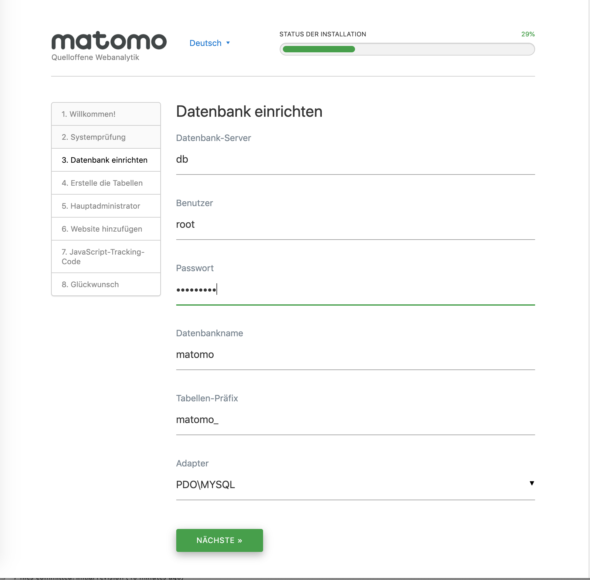

# matomo-nginx-docker
dockerized set up for matomo with mariadb and nginx

## create user
```
adduser --disabled-login matomo
adduser matomo docker
su - matomo`
```
## adapt docker files

1. Copy files from /home/matomo to your /home/matomo directory on server
2. Adapt nginx port 8088 in docker-compose.yml to your port number
3. provide db root password in db.env

```
/home/matomo# ls -l
...
-rw-rw-r-- 1 matomo   matomo   64 Jun 16 20:55 matomo.env
-rw-rw-r-- 1 matomo   matomo 1644 Jun 16 20:56 nginx.conf
-rw-rw-r-- 1 matomo   matomo  490 Jun 16 21:01 docker-compose.yml
-rw-rw-r-- 1 matomo   matomo   60 Jun 16 21:02 db.env
```

## why this additional nginx server
The docker matomo image doesn't provide a web server, but a fastcgi interface. Therefore we need 
an additional webserver, that translates the http requests to fastcgi. And in addition, there are
static html stuff in the docker image that aren't accessible from an external webserver.

## test your installation

```
docker-compose up
curl 127.0.0.1:8088 # should provide a result
docker-compose down
```

## frontend web server with nginx

1. copy matomo.conf to your /etc/nginx/sites-available
2. read through the sites-available/matomo.conf and modify the settings to fit your use case:
   * set server_name to the domain(s) of your Matomo instance
   * set the path to your SSL certificate. If you don't have an SSL certificate for your domain yet, check out Let's Encrypt.)
   * replace /var/www/matomo/ with the path to your Matomo instance
3. go to the sites-enabled folder of your nginx config directory
   and enable the Matomo config by creating a symlink: ```sudo ln -s ../sites-available/matomo.conf```
4. test if there is a syntax error in your nginx config: ```sudo nginx -t```
5. restart nginx: ```sudo systemctl restart nginx```
   
## matomo installation

1. Call matomo installation as defined in frontend web server, e.g. https://stats.example.com
2. Walk through installation steps
3. Provide the following database connection parameter where password is the one you set in db.env as MYSQL_ROOT_PASSWORD



## access maria db
````
sudo docker exec -it matomo_db_1 bash
````

